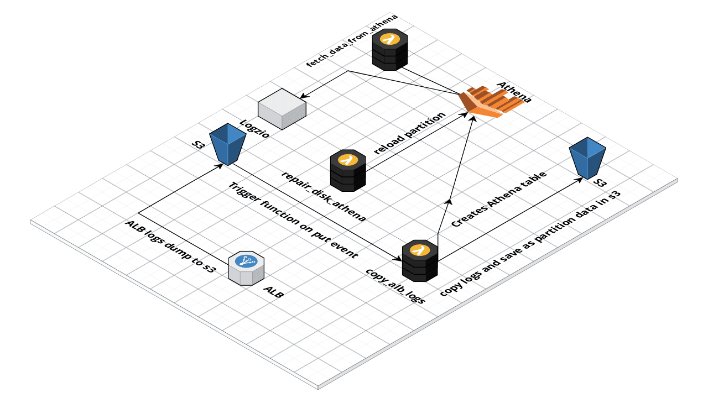

# ALB LOG PARSER

##### Alb Log Parser is a tool built on [serverless framework](https://serverless.com) which parse the ALB logs and load them in Athena.
Logs can be fetched by simple sql query on athena table.



This tool deploy 3 lamda functions.
1. copy_alb_logs

    This function triggers on the put event of S3 bucket where ALb logs are dumped. When ever a new file is pushed in the bucket from ALB, This func copies that file to project bucket which is created at the time of deployment.
    Then it creates the DB and table in Athena.

2. repair_disk_athena

    This function triggers once in a day at 12:06 am. Athena creates a new partition for every year then every month and day. Eg if date is 17/02/2018, log file path will be 2018/02/17/{filename}. So every day new partition is created. This function is responsible for loading that new partition by executing a query in athena.

3. fetch_data_from_athena

    This function triggers after every 5 minutes as ALB push logs every 5 minutes. It executes query to fetch data(by default non 200 http status urls) and post them to logz io.


## Pre-Requisites

```
Node.js v6.5.0 or later
Serverless CLI v1.9.0 or later
Python 3.6
AWS Account
aws-cli
```

## Installation

```npm install -g serverless```

## Verify Installation
```serverless --version```

## Tool Components
* config -: 
   
    This directory contains the configuration for every stage like staging or production. The present configurations are :-
	
* lambda_service_name -:

    Name of the Lamda service in AWS

* region :-

    AWS region where you want to deploy lambda. Make sure its in same region where ALB logs S3 bucket is.

* alb_logs_source_s3_bucket_path :-

    Path of the ALB logs in S3 eg {bucketname}/AWSLogs/{account id}/elasticloadbalancing

* alb_logs_destination_s3_bucket_name :-

    This the bucket name which will be created at the time of deployment.

* alb_logs_destination_s3_bucket_prefix :-

    The prefix of where your logs will be copied in S3 bucket

* athena_db_name :-

    Database Name of Athena

* athena_table_name :-

    Table name of in Database.

* athena_table_creation_logs_s3_path :-

    Path where table creation logs will be dumped

* athena_disk_repair_logs_s3_path :-

    Path where partition loaded logs will be dumped

* athena_query_execution_time_s3_key :-

    This key saves the time of fetch query executed in athena to ignore duplicate results.

* athena_is_db_created_s3_key :-

    This key helps to know is Database is created in Athena or not.
    
* handlers

    This directory contains all the files related to logic of this tool.

* connectors.py :-

    This file contains all the connectors as function to which the logs will be pushed. 
    Currently Logz.io is configured.
    
    Steps to include more connectors are :
    
    * Add new function to ```handlers/connectors.py```
    * Add required variables to ```handlers/environment_variables.py```
    * Call the new function from ```handlers/execute_athena_queries.py/fetchDataFromAthena```
    
* environment_valriable :-

    This file contains all the environment variable to be shared in lambda function.

* queries :-

    This file contains all the queries that will be executed in Athena.


## Getting Started

These instructions will get you a copy of the project up and running.

* Create a new IAM user [Create IAM User](https://docs.aws.amazon.com/IAM/latest/UserGuide/id_users_create.html#id_users_create_console) and download the credentials.
* Create a new policy [Policy Creation](https://docs.aws.amazon.com/IAM/latest/UserGuide/access_policies_create.html#access_policies_create-json-editor) using the policy defined in ```config/iam_deployment.json```
* Attach the policy to the new created user
* Install [AWS-CLI](https://docs.aws.amazon.com/cli/latest/userguide/installing.html) (if not configured)
* Configure the [AWS Credentials](https://docs.aws.amazon.com/cli/latest/userguide/cli-chap-getting-started.html#cli-quick-configuration) using 

```shell 
aws configure [--profile profile-name]
``` 
where profile-name can be ```production or staging or dev```.
For parameters type ```aws help```
* Attach deployment policy to the user. Sample polcy is present in config directory.
* Run deployment script

Serverless Deployment
---------------------
For deployment of this project in production ```deploy.sh``` is used.
its a shell script which deploy the lambda function and also install all the required python libraries used.

```shell
./deploy {config_file} {aws_profile}
```
config_file name must be present in config directory 

eg: ./deploy production {aws_profile}
This command will get configurations from production.json in config directory.


License
-------

BSD

Author Information
------------------

Fynd
Have feedback or want to submit bugs/feature requests? File an issue on the [Issue Tracker](https://gitlab.com/fynd/alb-logs-parser/issues)
